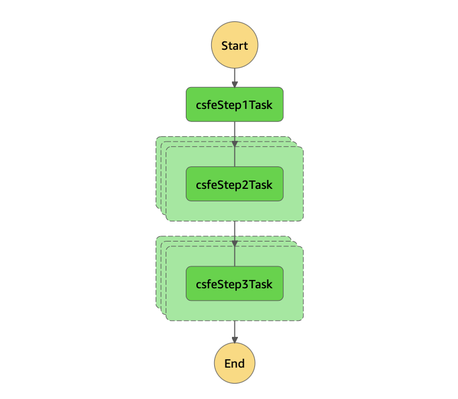

## Step Function deployment with CDK

This is an example of how to deploy a step function through CDK.

### Requirements

You need Node.js and CDK installed on your system. AWS credentials should be available
either as ENV variables or inside `$HOME/.aws/credentials`. Three requirement files are
then provided:

```
pip install -r source/requirements.txt
pip install -r utilities/ecr-requirements.txt
pip install -r aws/deploy-requirements.txt
```

### Structure of the repository

The repository is organised as follows:

- `aws/`: contains the code necessary to deploy to aws
- `source/`: contains the source code
- `utilities/`: contains few useful scripts

### How to run

The idea of this example is to deploy a 3-steps step function on AWS.
Each step is made of a batch job that runs the docker image provided under
`source`. Such image does nothing, it simply prints out the input parameters.
The docker image needs to be available on the AWS ECR first.

How to get it running:

 - step 1: push the docker image to the ECR (see `utilities/README.md`)
 - step 2: deploy the step function (see `aws/README.md`)
 - step 3: trigger the step function via console to test
 - step 4: destroy the step function and the image on ECR.

The following is the diagram representing the step function definition:



The execution input for an execution must have the following format:

```
{
  "parameters": {
    "step1_parameter": "step1",
    "step2_parameters": [
      "step2a",
      "step2b"
    ],
    "step3_parameters": [
      "step3a",
      "step3b"
    ]
  }
}
```

The step 2 and 3 parameters must be a list which is mapped for parallel execution.

### Code formatting

The repo follows the standards of `flake8`, `black` and `isort`.
To install the pre-commit hooks run:

```
pip install -r dev-requirements.txt
pre-commit install
pre-commit install -t pre-push
```

Checks can be triggered manually with the command:
```
pre-commit run --all-files --show-diff-on-failure
```

The package configuration is included in the `setup.cfg` and `pyproject.toml`.

### CDK

CDK stands for AWS Cloud Development Kit, which is a software development framework for
defining cloud infrastructure in code and provisioning it through AWS CloudFormation.
See https://docs.aws.amazon.com/cdk/latest/guide/home.html .

### Useful documentation

```
https://docs.aws.amazon.com/cdk/latest/guide/home.html

https://github.com/aws-samples/aws-cdk-examples/tree/master/python/stepfunctions

https://github.com/AlexIoannides/py-docker-aws-example-project
```